<h1 align="center">Cybersparker 攻击面管理利用系统</h1>

<div align="center">

<p>
  
  
  
  
  
  
</p>
<p>致力于开源的攻击面管理和利用系统，目前能力：公网/内网测绘、漏洞验证（py/nuclei）、多模态AI维护PoC、指纹/PoC调试能力。</p>

</div>

智能体元年，Cybersparker 造了一个轮子，其目的在于适应高速发展的AI时代，我们需要一个自主定制、可被AI维护与快速迭代的开源系统，以适应复杂且随着AI正在发生变化的实战需求，系统本身正是由4月发布的DeepSeek V4 Pro全程主导，人类没写一行代码，历时2个月的设计、开发、调错、部署，发布的目的是借助开源社区的力量让系统更强大、更有活力，我已经为大家摊平一条路，证明了国产AI +人类专家协作 = BT-7274 + 铁驭，DS或许不是最强泰坦，我也只是一个普通步枪兵，但我们在一起的作战效能超过了90%。本系统通过自研SKILL+项目文档驱动进行开发，任何AI都可以使用.claude下的/project-control-plane技能与./docs下的项目文档来立刻接手、开发新功能，欢迎你和你的AI提交Pr，我相信每个师傅都有自己独到的经验和思路，我们希望融合百家之长，如今编码已经不能束缚我们，思想才是最珍贵的东西，工具不过只是思想的延伸。

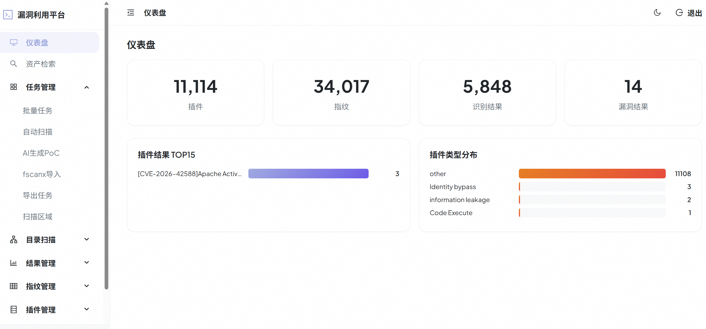

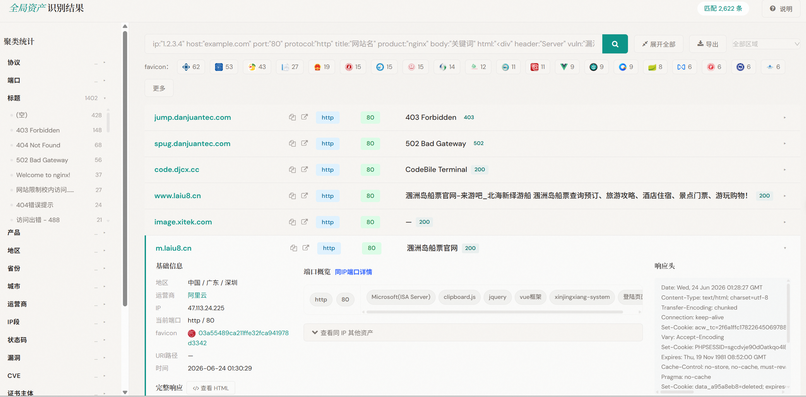

## 特性

- 🔎**内网资产测绘**

  - 支持配置多个代理服务（http/socks5），所有任务都可以配置代理，通过代理可探测目标内网
  - 支持导入fscanx的输出文件，直接入库可查询。 [fscanx](https://github.com/killmonday/fscanx) （ https://github.com/killmonday/fscanx ）具备协议、产品识别的能力，公网/内网都可以探测
  - 支持检索fscanx扫描出的多种协议弱口令、MS17010漏洞、OS版本信息、rdp信息、netbios网卡信息、smb/ftp文件清单等
  - 支持资产展示、聚类统计，友好的检索语法

- 🌐**公网资产测绘**

  - 支持6种输入来源作为任务目标：

    - 上传txt文件

    - 选择历史上传过的文件
    - 从测绘平台导入数据：fofa、quake、hunter、zoomeye、shodan
    - 选择历史任务中从测绘平台拉取过的旧数据
    - 上传fscanx输出文件（result.txt），直接入库，立刻可检索
    - 输入cybersparker自身的测绘前台的检索语句，自动关联数据库里的数据作为任务输入

  - 支持边扫边打、扫完再打。

  - 支持资产展示、聚类统计，友好的检索语法

- 🚀**漏洞扫描**

  - 支持python脚本，默认hook requets库实现全局代理控制、url参数适配漏洞payload优化（学习自pocsuite3）
  - 支持Nuclei 1w+ yaml PoC（已导入），基于pocsuite3的nuclei语法解析引擎继续优化，支持更多模板和参数
  - 支持配置ceye dnslog，提供无回显漏洞的验证能力。
  - 插件可绑定产品指纹，在任务中可选择仅调用该产品对应的PoC进行验证，减少无效发包量
  - AI通过字符相似算法，已自动绑定Nuclei 1w+ PoC到本系统的产品指纹上，用户后续也可以自由绑定和解绑
  - 支持配置代理+代理池

- 🧠**AI生成PoC**

  - 支持在后台配置兼容OpenAI协议的任何模型API
  - 支持通过漏洞文章的URL链接生成PoC，系统使用 无头浏览器 -> 爬取 -> 渲染 -> html清洗 -> markdown+图片，对图片调用视图模型转为结构化文字插入markdown，最后把markdown作为思考模型的输入来生成PoC
  - 支持上传压缩包生成PoC，系统会解压后把所有文本文件（代码、markdown等）转为json字符串，把所有图片调用视图模型转为结构化文字，加上系统EXP规范提示词、用户自定义提示词，全部转为json字符串传输给模型。
  - 用户在前端检查模型输出的PoC代码，确认后自动入库保存，直接可用。
  - TODO：自动从Github、微信公众号、各大漏洞库等数据源爬取数据 -> 生成PoC审核队列 -> 人类专家确认。实现全自动PoC运营维护。

- ✨**目录扫描**，支持在目录扫描过程中识别产品 + 自动漏洞扫描。可统计排序扫描结果。

- 🎨**指纹编写调试**，支持实时编写、实时调试匹配结果

- …… 由你续写

## 功能展示

### 1.批量漏洞任务

顾名思义，该任务专门扫漏洞，可以自己选择多个PoC对输入目标进行漏洞验证。插件留空 = 全量PoC扫描，适合已授权的漏洞扫描场景。

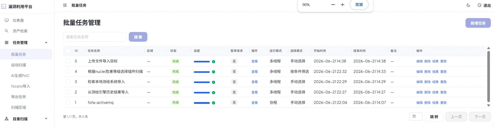

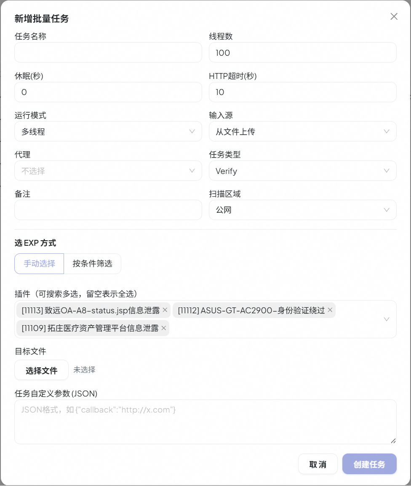

PoC选择的方式除了下拉菜单直接选择，还可以根据nuclei的危害等级、标签来筛选：

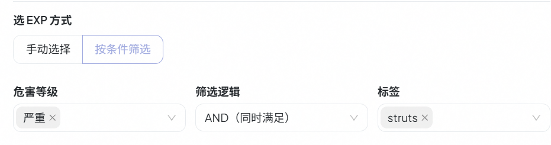

点击任务右侧“结果”按钮，可查看该任务的扫描结果，例如：

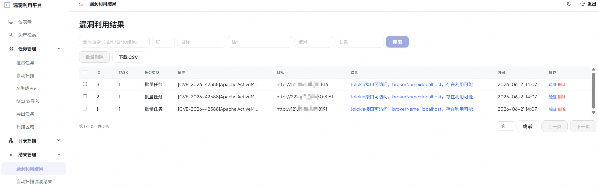

点击“验证”，可实时验证该漏洞现在是否依然存在。漏洞存在时，入库的验证结果由PoC插件自身决定，用户也可以自己修改。

批量漏洞任务的结果也会同步“自动扫描任务”测绘的资产，可在检索页面搜索到，存在漏洞的资产会标记红色：

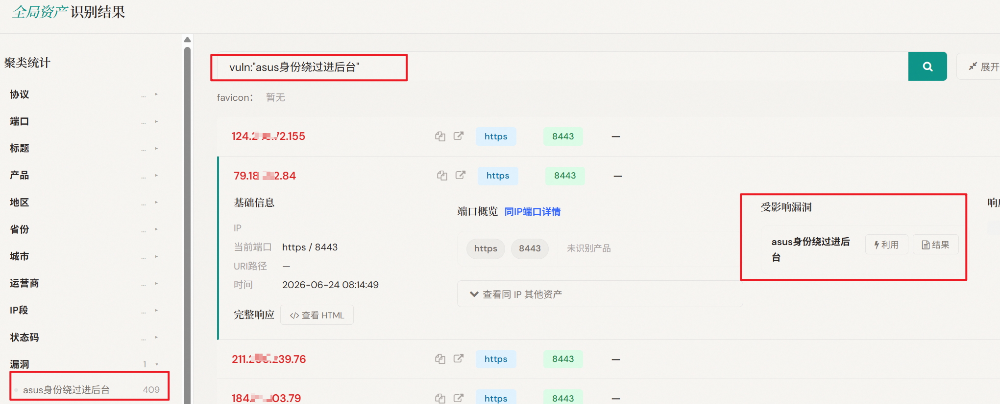

### 2.自动扫描任务

该类型的任务做两件事情：**测绘**和**漏扫**，但它可以在测绘识别到产品后，自动调用产品绑定的PoC插件，因此叫做自动扫描任务。

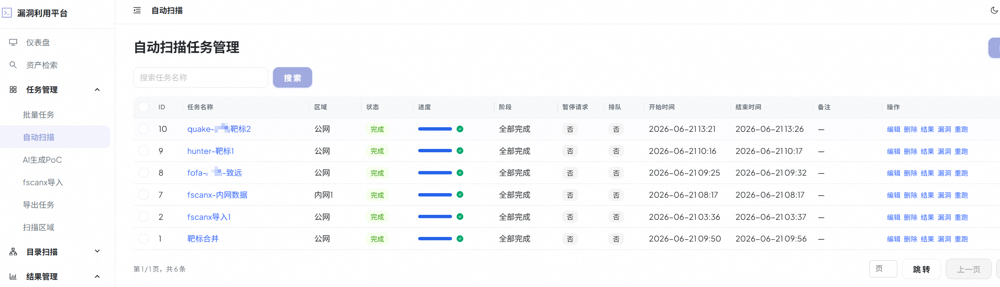

点击“结果”可以跳转到该任务自己的资产检索页面，仅仅展示该任务扫描到的资产：

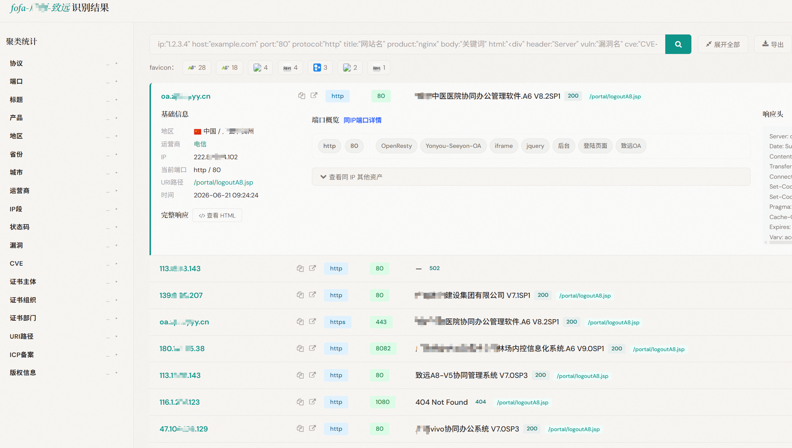

### 3.AI生成PoC

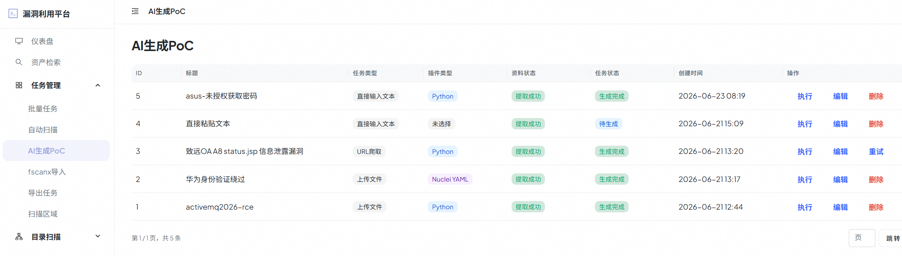

该任务支持3种生成方式，“URL”、“上传文件”、“直接输入文本”：

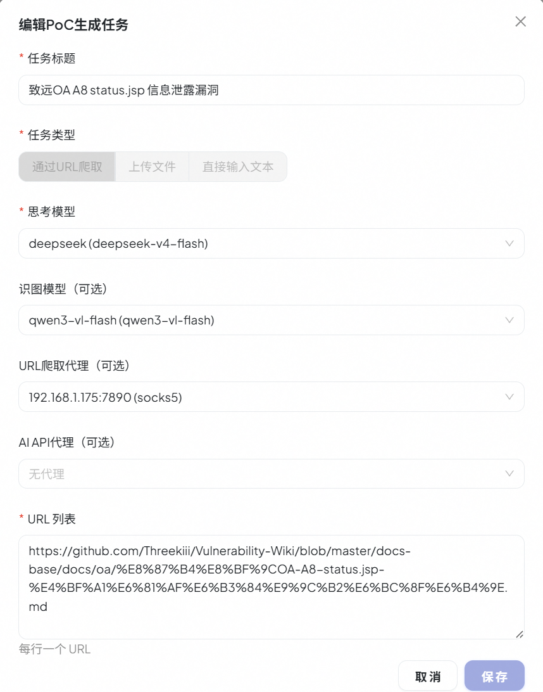

爬取处理完成后，点击“执行”可进入生成控制页面，这里只需要操作3步（其他框框是系统自带的，当然你也可以修改，改后鼠标离开编辑框就会自动保存入库，改了系统提示词以后不会影响其他任务，如果需要全局修改系统默认提示词，需要到代码里改）：

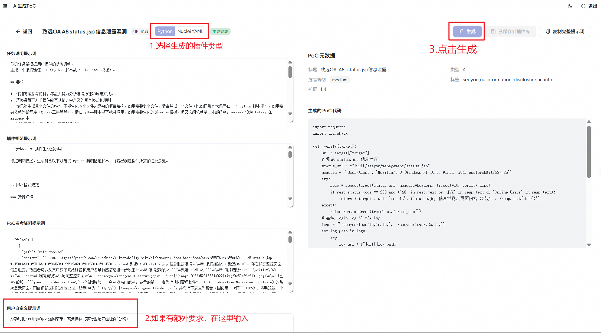

### 4.fscanx导入结果查看

fscanx的导入要在“自动扫描任务”中导入，导入时选择输入源为“fscanx输出文件”，扫描区域根据实际情况选择“公网”或者“xxx内网”。这个“xxx内网”需要在“扫描区域”页面添加，之所以这么设计，是因为内网测绘和公网不同，公网里的ip是唯一可以标识一个资产的，比如8.8.8.8，而内网里的192.168.1.1却可以在多个不同目标的内网同时存在，因此需要用区域这个概念来区分不同内网。

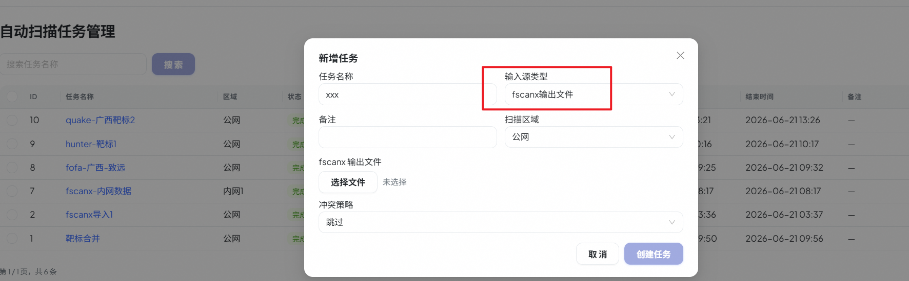

导入后，点击“结果”就能进入资产检索页面。另一方面，如果是内网测绘，还会有一些特殊的内网信息，如扫描出的弱口令、OS版本、MS17-010漏洞信息、ftp/smb文件清单等，这些信息需要在左侧导航栏的“fscanx导入”页面查看，这些数据不在测绘的资产检索页面展示，所以单独在这里展示：

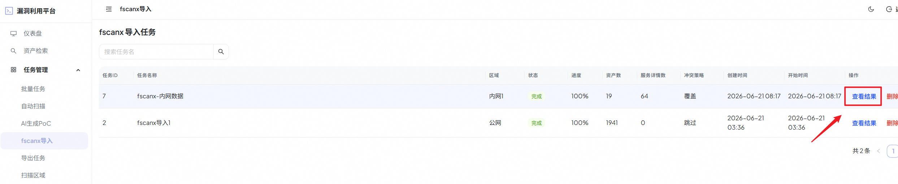

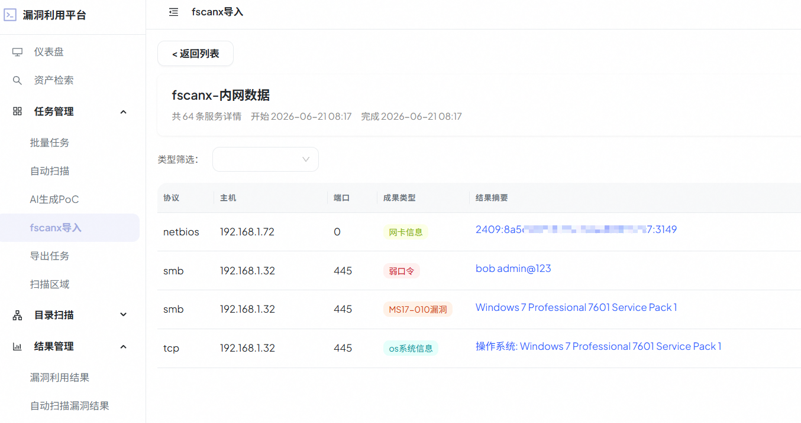

### 5.目录扫描

比较简单，可以设置字典组和组内字典，输入源是历史的自动扫描任务结果，直接勾选任务，或者用检索语句来筛选你想要的资产作为目标。

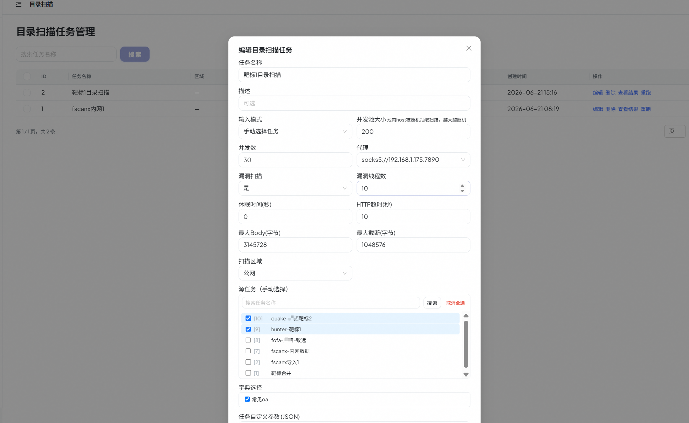

可以根据长度、状态码等排序，可以检索。另外目录扫描过程识别到的产品会同步更新到自动扫描任务识别的资产，可以在检索平台搜索到。

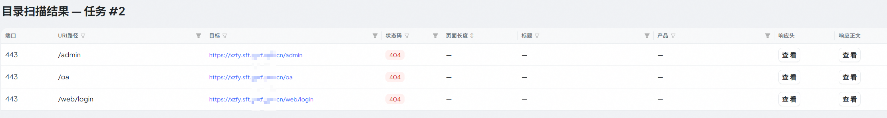

### 6.漏洞结果管理

此处可以查看所有任务汇总的漏洞结果，可以导出csv，可以检索、过滤找到关心的高价值目标，如搜索 gov

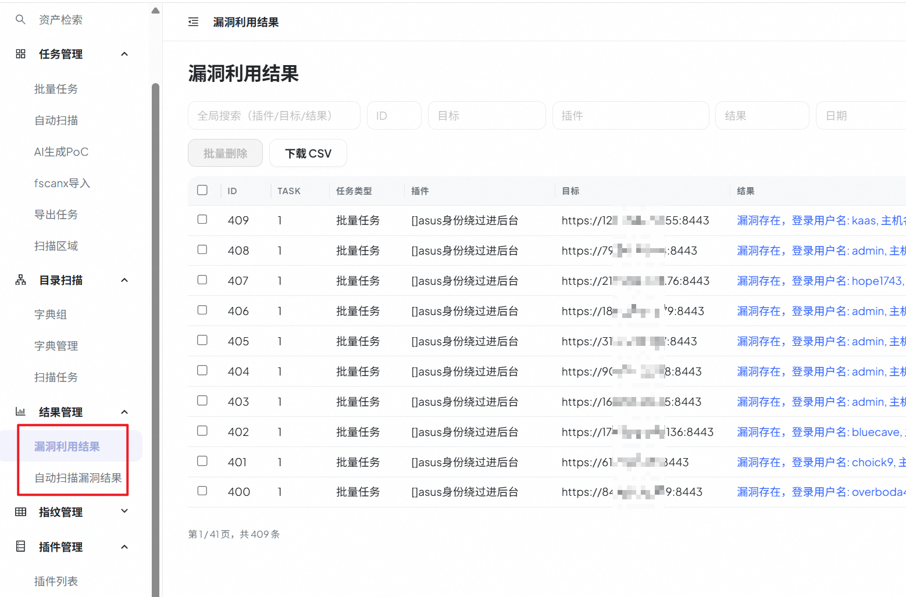

### 7.指纹调试

指纹编写规则，可参考该页面的提示和现有指纹内容。

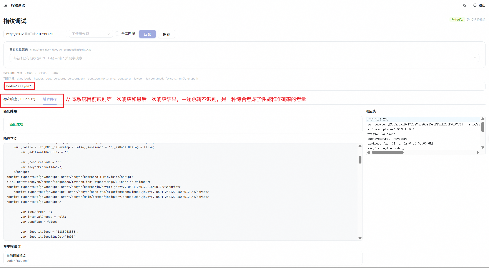

### 8.PoC插件调试

记得先配个ceye dnslog，系统已经hook相关nuclei变量，无回显的nuclei插件将自动使用该dnslog。

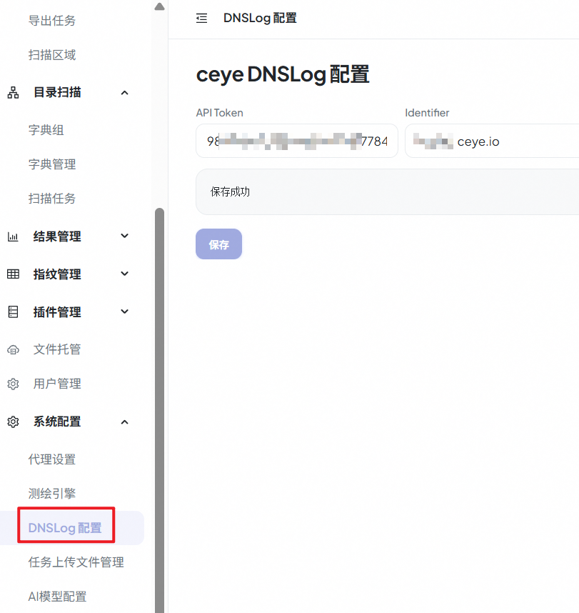

随便挑选一个java反序列化+dnslog验证的poc，测试本地docker靶场验证成功：

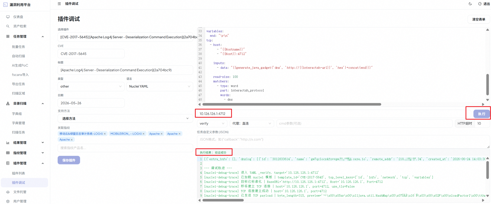

注意Nuclei YAML 引擎目前系统只支持 `http/requests` 和 `tcp/network` 两类顶层协议块，比较少用到的code协议（仅1.2k个）需要在本机运行第三方代码来验证漏洞，相对危险不可控，不打算支持。

### 9.AI模型配置

系统支持思考类型的模型（纯文字处理）、识图类型的模型（用来处理图片->结构化文字）。思考类型的模型当前只支持OpenAI协议接口。大部分模型都提供了OpenAI协议接口，例如deepseek，在此我们也期待它的识图能力上线到API（目前仅在网页版）：

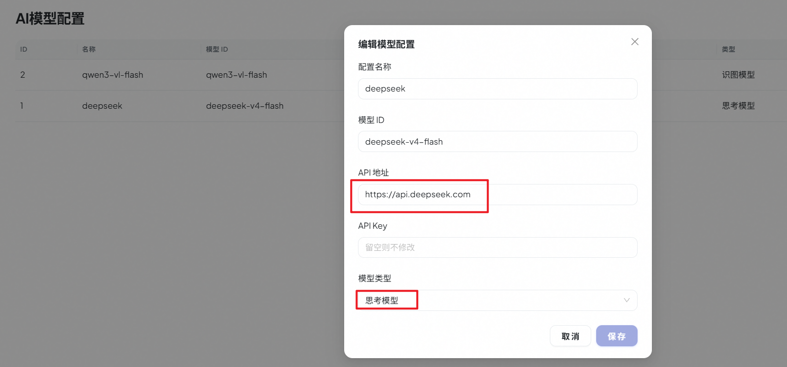

识图模型目前仅支持阿里云百炼的api和sdk，所以必须使用qwen系列识图模型，比较便宜好用的是qwen3-vl-flash，百炼有免费额度，我至今没有用完。必须配置的api地址是 https://dashscope.aliyuncs.com/compatible-mode/v1 ：

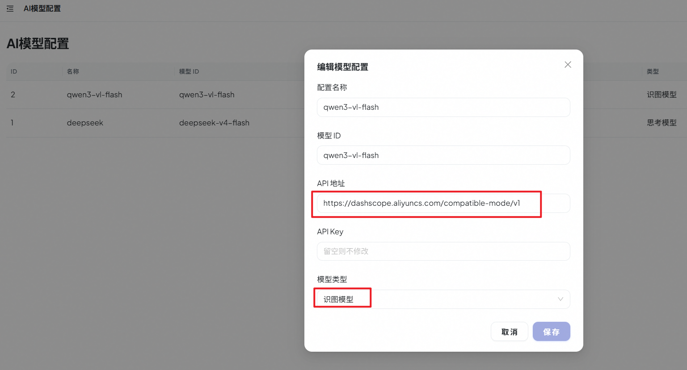

### 10.测绘引擎配置

只有fofa需要邮箱，其他的不需要。

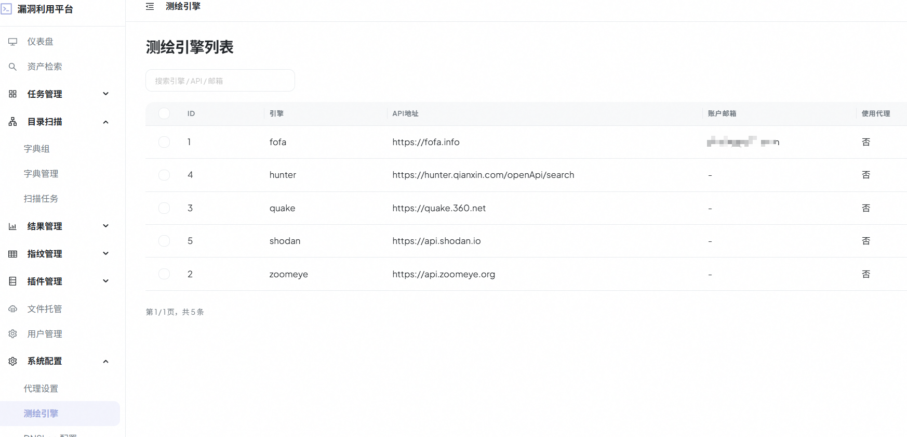

## 快速启动

docker一键部署：

- 如果你有网络环境问题，不想自己构建，你可以下载我打包好的docker镜像，导入后直接 docker compose up 就可以运行成功，查看本项目release，或者直接下载 `https://github.com/killmonday/cybersparker/releases/download/v1.0/docker_cybersparker_images.tar`。

  然后执行`docker load -i docker_cybersparker_images.tar `  来导入镜像。

- 如果你要自己构建镜像，那么修改docker-compose.yml里的所有代理配置为你自己的代理：

```
      args:
        - HTTP_PROXY=http://192.168.137.120:7890
        - HTTPS_PROXY=http://192.168.137.120:7890
```

​	如果你的网络环境不需要代理，去掉args整体，然后把 `build:`改为`build: -`，如果你不会改就让AI改。然后构建：

```bash
# 在项目目录下执行
docker compose up 
```


- 启动后，默认web端口为28600。访问 http://ip:28600
- 默认登录账号为admin/admin。若线上部署，请立刻修改密码。

## 项目目录

```text
cybersparker/
├── cybersparker/                 # Django 项目配置（settings / urls / celery）
├── app_cybersparker/             # 主应用（模型、视图、服务、任务执行、运行时）
├── frontend/                     # React 前端工程
├── scripts/                      # AI PoC URL 爬取与资料清洗脚本
├── deploy/                       # Docker / Nginx / 启动 / 备份恢复 / 种子数据脚本
├── docs/                         # 设计、模块文档、项目控制台、开发索引
├── plans/                        # 非琐碎任务执行记录
├── CHANGELOG.md                  # 变更记录
├── Dockerfile
└── docker-compose.yml
```
## 技术栈

### 后端

| 层 | 技术 | 说明 |
|---|---|---|
| 语言 | Python 3.11+ | |
| Web 框架 | Django 4.1 | 生产模式用 Gunicorn，开发模式用 runserver |
| 数据库 | PostgreSQL 17 | 含 pg_bigm 扩展（中文全文检索），连接池用 django-db-connection-pool |
| 缓存 / 消息 | Redis 7 | Celery 消息队列 + 任务状态缓存 + 资源租约令牌 |
| 异步任务 | Celery 5.4 | 7 个队列：auto_scan、batch_scan、batch_scan_gevent、result_writer、maintenance、dir_scan、poc_generation |
| 协程 | gevent | 批量任务协程子进程模式 |
| 异步 HTTP | aiohttp | 自动扫描批量异步请求 |
| socks 代理 | aiohttp-socks、PySocks | 支持 SOCKS5 代理的异步请求 |
| HTTP 客户端 | requests、httpx | 同步请求和插件内 HTTP 调用 |
| HTML 解析 | BeautifulSoup4、lxml | 指纹识别响应解析 |
| favicon hash | mmh3 | favicon 图标哈希计算 |
| YAML | pyyaml | Nuclei YAML 模板解析 |
| GeoIP | geoip2 | IP 地理位置查询 |
| AI 模型 | openai、dashscope | OpenAI 兼容 API + 阿里云 DashScope（通义千问识图） |
| 压缩 | py7zr | 上传资料解压（7z/zip/tar.gz） |
| 图片 | Pillow | URL 爬取图片处理 |
| 哈希 | xxhash | 文件/数据快速哈希 |

### 前端

| 层 | 技术 | 说明 |
|---|---|---|
| 框架 | React 18 | 函数组件 + Hooks |
| 构建 | Vite | 开发 HMR 热更新，生产自动 chunk 拆分 |
| 语言 | TypeScript | 严格模式 |
| UI 库 | antd 6.x | Table、Form、Modal、Select 等 |
| 路由 | react-router-dom v6 | BrowserRouter，basename=/react-shell |
| HTTP | fetch | 自定义封装，自动 CSRF token、统一错误处理 |
| 代码编辑器 | @uiw/react-codemirror | 插件调试 / 指纹调试页 |
| 字体 | DM Sans、Spectral、Font Awesome | 全局字体 + 图标 |

### 部署与基础设施

| 层 | 技术 | 说明 |
|---|---|---|
| Web 服务器 | Nginx | 端口 28600，React 静态文件直返 + API 反代到 Django :8999 |
| 容器化 | Docker + Docker Compose | 5 个服务：postgres、redis、web（gunicorn）、worker（celery）、nginx |
| 代理 | HTTP / SOCKS5 | 请求运行时 monkey-patch 注入，支持重定向保持 |
| 云 API | Fofa / Shodan / ZoomEye 等 | 空间测绘引擎适配器统一接口 |

### 外部工具链

| 工具 | 用途 |
|---|---|
| Puppeteer + Chromium | AI PoC 的 URL 爬取（页面渲染 + HTML → Markdown） |
| turndown | HTML → Markdown 转换（Node.js） |
| Nuclei YAML | 漏洞验证模板（自有兼容引擎，支持 http/requests 和 tcp/network 协议块） |
## 本地开发

使用vscode+docker container打开本项目，本项目配置了dockercontainer，在vscode打开会自动提示，确认后自动创建开发容器，默认会装好npm、python。然后用root权限在容器中执行deploy/setup-env.sh安装环境，如nginx、postgresql、redis等。

数据库和redis和nginx启动：

```
pg_ctlcluster 17 main start
redis-server --port 6379 --daemonize yes
nginx
```

django和celery：

```bash
pip install -r requirements.txt
python manage.py migrate
python manage.py runserver 0.0.0.0:8999
bash start_celery.sh
```

前端编译：

```bash
cd frontend
npm install
# npm run dev 可启动独立web服务以方便前端开发，也可以用nginx
```

安装爬取URL页面需要的依赖，进入项目目录下的scripts：

```bash
cd scripts
npm install
```

更详细的环境准备、PostgreSQL / Redis / Chromium 说明，请直接看 [`docs/项目启动文档.md`](./docs/项目启动文档.md)。如果有问题，可以让AI一把梭。

## TODO

- 完善使用说明文档、二次开发文档、备份文档等。有疑问可以先看docs/modules里的模块设计文档或直接问AI
- 使用图数据库+AI构建产品、组件、指纹、CVE、漏洞脚本的知识图谱，成为AI时代的基础设施，提供mcp调用的指纹识别、漏洞利用
- AI+人类协作实现自动化运营的PoC采集、入库，从Github、微信公众号、漏洞库、复现文章自动生成平台标准化PoC
- Java类漏洞的基础设施构建，如一些反序列化漏洞需要一个公网的tcp端口提供一些特定服务，可作为系统内置能力提供PoC调用
- 支持自建的dnslog，本人对于dnslog也做过研究，可对抗一些封禁手段，后续有空会加入，并封装为系统函数给PoC调用
- 目前python插件的标准化输入是一个字典，可传入函数给PoC调用，大家可以自由发挥，添加系统功能给PoC调用
- 增强信息收集能力；增加新的攻击面发现和利用任务。
- ……，有好的想法可以提交issus

## 项目文档导航

| 文档 | 用途 |
|---|---|
| [`docs/项目控制台.md`](./docs/项目控制台.md) | 给AI看当前阶段、已完成能力、剩余风险 |
| [`docs/当前实现总览.md`](./docs/当前实现总览.md) | 看现有能力和关键代码入口，作为缩略的索 |
| [`docs/设计总览.md`](./docs/设计总览.md) | 看系统结构、主链路、关键设计决策 |
| [`docs/项目启动文档.md`](./docs/项目启动文档.md) | 看环境、启动、部署和依赖 |
| [`docs/开发文档索引.md`](./docs/开发文档索引.md) | 看全文档入口与阅读顺序 |
| [`docs/modules/`](./docs/modules) | 按模块查看范围、接口、约束 |
| [`docs/backlog/`](./docs/backlog) | 按模块查看 backlog 与验收状态 |
| [`plans/`](./plans) | 看每次任务到底做了什么、为什么这么做 |

## License

GNU General Public License v3
