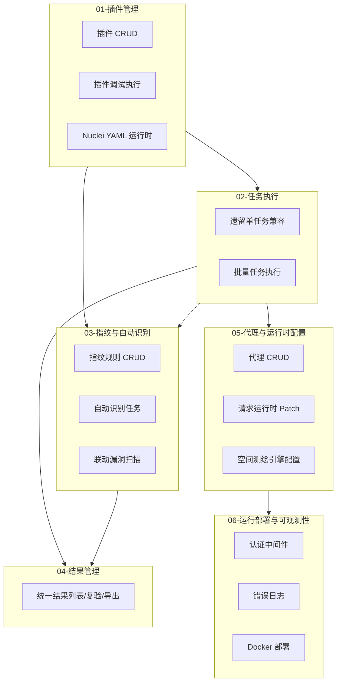

# 模块总览

## 模块划分

| 编号 | 模块 | 职责 | 状态 |
|---|---|---|---|
| 01 | 插件管理 | 插件 CRUD、调试执行、多语言运行时 | 已实现 |
| 02 | 任务执行 | 批量任务创建、启停、执行编排；保留遗留单任务兼容 | 已实现 |
| 03 | 指纹与自动识别 | 指纹规则管理、产品识别、联动扫描 | 已实现 |
| 04 | 结果管理 | 结果汇总、复验、导出、删除 | 已实现 |
| 05 | 代理与运行时配置 | 代理管理、请求 Monkey Patch、引擎配置 | 已实现 |
| 06 | 运行部署与可观测性 | 认证、日志、Docker 部署 | 已实现（基础） |
| 07 | 目录扫描 | 字典管理、目录任务、随机化引擎、JS 跳转 | 已实现 |
| 08 | 前后端分离 | React 前端、API 契约、20 页迁移完成 | 已实现 |
| 09 | 文件管理 | 目标文件上传/下载/删除、引擎数据自动清理 | 未开始 |
| 10 | AI生成PoC | AI模型配置、PoC生成任务（爬取/上传→提示词→生成→入库） | 未开始 |
| 13 | 扫描区域与资产域 | 扫描区域管理、资产区域归属、跨区域检索与目录扫描根资产绑定 | 规划中 |

## 模块依赖关系

## 横切说明

08-前后端分离模块是页面层横切模块：它不改动扫描、调度、写库主链路，而是在 Django 母版和业务页之外，逐步补 React 内容区和 `/api/v1` 契约层。

## 数据流概览

1. **插件管理与调试执行**：用户编辑插件 -> 保存到 DB + 文件系统 -> 调试执行 -> `importlib` 动态加载 -> 调用约定函数 -> 返回结果
2. **批量任务执行**：用户创建批量任务（选多插件 + 输入源） -> `resolve_target_source()` -> `startTask()` -> 线程/子进程执行 -> bulk_create 结果
3. **自动识别任务**：用户上传目标 -> `scanner.start()` -> `request_consumer()` 请求目标 -> 指纹规则匹配 -> 可选联动漏洞扫描 -> 结果落库
4. **结果管理**：各模块产出结果 -> 统一列表查询 -> 复验/下载/删除

补充：历史 `EXPTask` 单任务链路仍保留兼容，但已不再是当前主流程，不再继续扩展新能力。

## 关键共享资源

| 资源 | 位置 | 使用者 | 备注 |
|---|---|---|---|
| `THREAD_DIC` | `cybersparker/settings.py:22` | 遗留单任务兼容 | 仅本机句柄缓存 |
| `BATH_TASK_DIC` | `cybersparker/settings.py:24` | 批量任务执行 | 仅本机句柄缓存 |
| `KILL_AUTO_TASK_DIC` | `cybersparker/settings.py:27` | 自动识别任务 | 仅本机句柄缓存 |
| Redis | `redis://127.0.0.1:6379` | Celery broker、资源 lease、运行时信号、spool 降级 | 运行态/协调真源 |
| Celery 队列 | `auto_scan`/`batch_scan`/`batch_scan_gevent`/`result_writer`/`maintenance`/`dir_scan` | 任务调度与结果写入 |
| 资源 lease | `resource_lease_service.py` | Redis Lua lease（http_inflight/threads/coroutines/db_writers） |
| result_spool | `result_spool/` 目录 | Redis 不可用时的本地文件降级缓冲 |
| ~~`conf.proxies`~~ | `request_runtime/conf.py` | 已废弃，改用 thread-local sentinel 模式 |
| `EXP_plugin/` | 项目根目录 | 插件执行引擎 |
| `error_log/` | 项目根目录 | 全部视图异常 |
