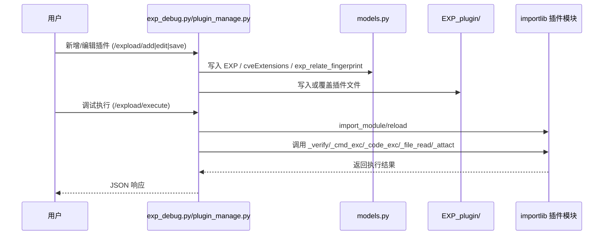
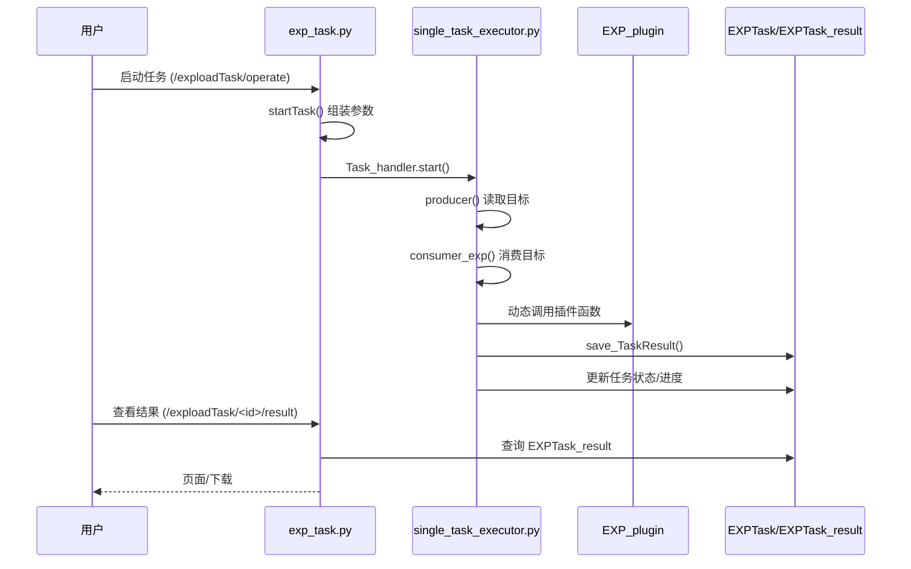
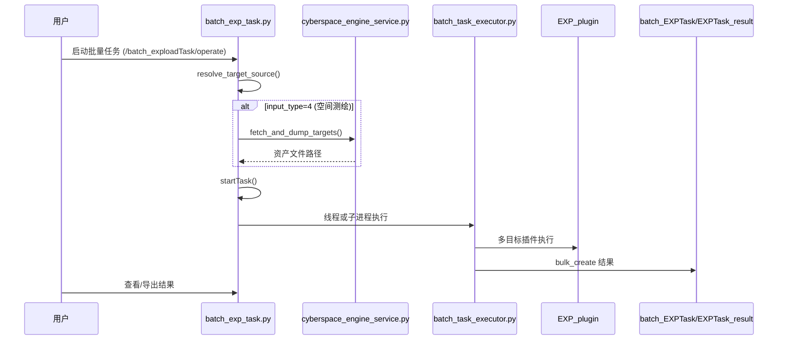
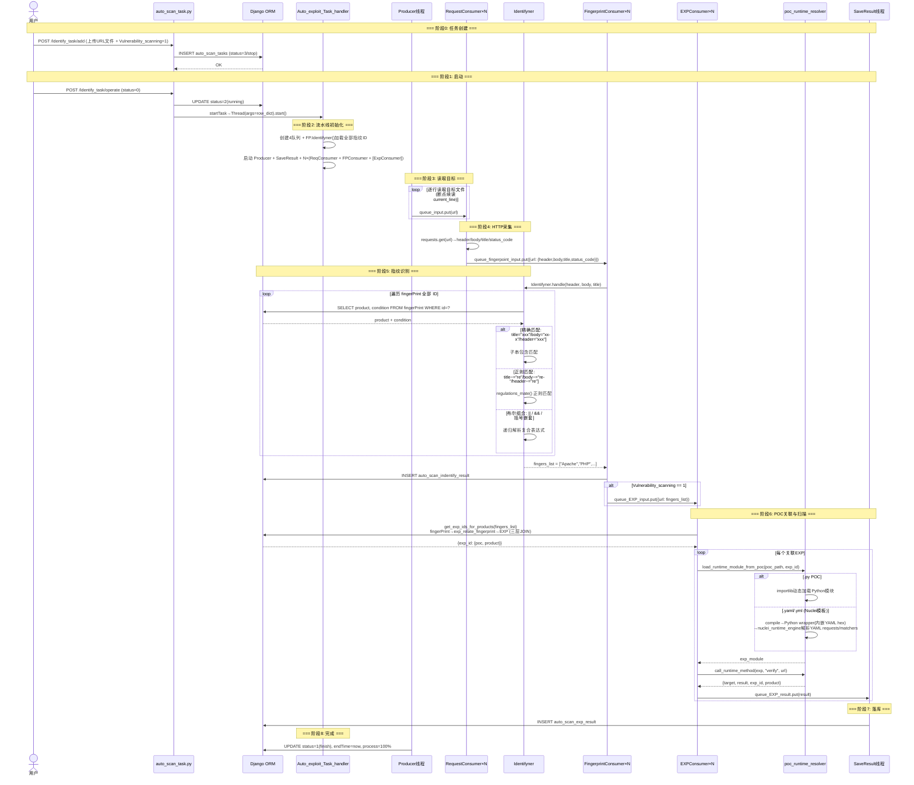

# 核心业务调用链

> **历史参考**：本文档写于项目早期，引用的代码路径（含已删除的 `single_task_executor.py`）和 URL 路由均为旧 Django 模式。当前调用链以 `docs/当前实现总览.md` 和 `docs/设计总览.md` 为准。保留本文档作为初始架构理解的参考。

## 1) 插件管理与调试执行链路

关键代码：
- 插件管理：`app_cybersparker/views/expload/plugin_manage.py:90`
- 调试执行：`app_cybersparker/views/expload/exp_debug.py:147`
- 保存插件：`app_cybersparker/views/expload/exp_debug.py:261`

## 2) 单任务执行与结果产出

关键代码：
- 启停入口：`app_cybersparker/views/expload/task_manage/exp_task.py:283`
- 启动执行器：`app_cybersparker/views/expload/task_manage/exp_task.py:236`
- 执行与落库：`app_cybersparker/views/expload/task_manage/single_task_executor.py:133`, `app_cybersparker/views/expload/task_manage/single_task_executor.py:173`, `app_cybersparker/views/expload/task_manage/single_task_executor.py:113`

## 3) 批量任务执行（含网络空间测绘输入）

关键代码：
- 输入源解析：`app_cybersparker/views/expload/task_manage/batch_exp_task.py:272`
- 测绘预处理：`app_cybersparker/views/expload/task_manage/batch_exp_task.py:243`
- 子进程运行：`app_cybersparker/views/expload/task_manage/batch_task_executor.py:440`

## 4) 自动识别与联动漏洞扫描链路（Identify_task）

### 流程总览

```
用户上传目标文件 → HTTP请求采集 → 指纹识别(Identifyner) → 入库(auto_scan_indentify_result)
    → [可选] POC关联(get_exp_ids_for_products) → 动态加载POC(poc_runtime_resolver)
    → 执行verify → 入库(auto_scan_exp_result)
```

四队列生产者-消费者流水线：

```
[目标文件] → queue_input → [HTTP请求线程×N] → queue_fingerpoint_input
    → [指纹识别线程×N] → queue_EXP_input → [漏洞扫描线程×N]
    → queue_EXP_result → [结果入库线程]
```

### 详细时序



### 指纹规则语法

| 语法 | 含义 | 示例 |
|------|------|------|
| `title="xxx"` | 标题包含 | `title="Apache Tomcat"` |
| `body="xxx"` | 响应体包含 | `body="wp-content"` |
| `header="xxx"` | 响应头包含(默认) | `header="nginx"` |
| `title~="re"` | 标题正则 | `title~="Apache/[\d.]+"` |
| `body~="re"` | 响应体正则 | `body~="phpmyadmin"` |
| `header~="re"` | 响应头正则 | `header~="Server: .*"` |

布尔逻辑：`||`(或)、`&&`(且)、括号嵌套如 `title="php"||(body="mysql"&&header="apache")`

### POC运行时解析 (poc_runtime_resolver)

| POC类型 | 加载方式 |
|---------|----------|
| `.py` (Python3) | `importlib.util.spec_from_file_location` 动态加载为模块 |
| `.yaml/.yml` (Nuclei) | 直接走 `poc_runtime_resolver._build_yaml_wrapper()` → `nuclei_runtime_engine.run_nuclei_template()`，不再生成中间 `.py` 文件 |

统一调用入口：`call_runtime_method(exp, "verify", url)`，nuclei_yaml 仅支持 verify 模式。

当前协议边界：
- 支持：`http/requests`、`tcp/network`
- 不支持：`code/javascript/headless/file/dns/ssl/websocket/whois`
- 导入命令会直接跳过不支持协议模板；历史数据统一通过 `cleanup_nuclei_unsupported_templates` 清理。

### EXP-指纹关联查询

```
识别产品列表 → fingerPrint 表(按product查) → exp_relate_fingerprint 关联表 → EXP 表
```

同一产品可关联多个 EXP，按产品名字典序取优先级最高者。

### 关键代码

- 视图入口：`app_cybersparker/views/expload/task_manage/auto_scan_task.py:183` (Task_operate)
- 任务启动：`app_cybersparker/views/expload/task_manage/auto_scan_task.py:164` (startTask)
- 主控线程：`app_cybersparker/views/expload/task_manage/auto_exp_task.py:48` (Auto_exploit_Task_handler)
- HTTP 采集：`app_cybersparker/views/expload/task_manage/auto_exp_task.py:214` (request_consumer)
- 指纹匹配：`app_cybersparker/views/expload/task_manage/fingerprint_indentify.py:80` (Identifyner.handle)
- 指纹规则匹配：`app_cybersparker/views/expload/task_manage/fingerprint_indentify.py:61` (check_rule)
- EXP 关联查询：`app_cybersparker/views/expload/task_manage/auto_exp_task.py:128` (get_exp_ids_for_products)
- POC 动态加载：`app_cybersparker/views/expload/task_manage/poc_runtime_resolver.py:151` (load_runtime_module_from_poc)
- POC 方法调用：`app_cybersparker/views/expload/task_manage/poc_runtime_resolver.py:180` (call_runtime_method)
- Nuclei 运行时：`app_cybersparker/views/expload/task_manage/nuclei_runtime_engine.py`
- 数据模型：`app_cybersparker/models.py` (auto_scan_tasks, auto_scan_indentify_result, auto_scan_exp_result, fingerPrint, EXP, exp_relate_fingerprint)
